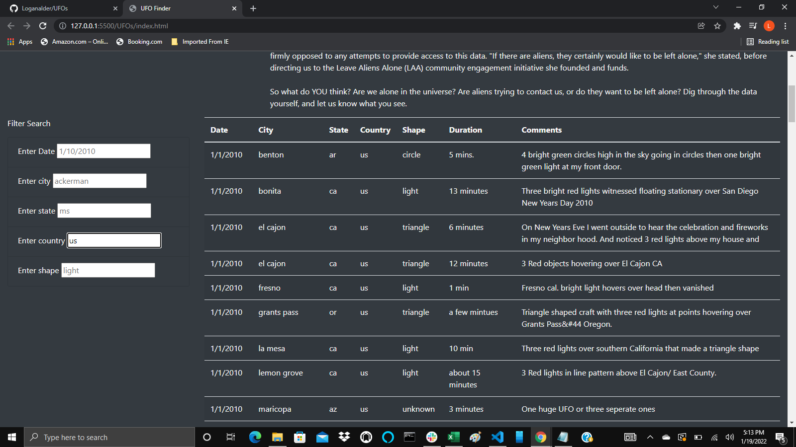
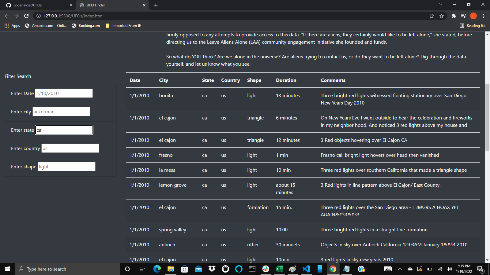

# UFOs
## Overview of Project
The purpose of the analysis was to enable users to filter the data in Dana's table.

## Results
Users are able to filter the information by date, city, state, country and shape. Below is an image showing the use of the country filter. 

Users who wish to filter more narrowly will be satisfied, as shown below.

## Summary

The webpage does not allow for multiple values to be entered under the same key. 

